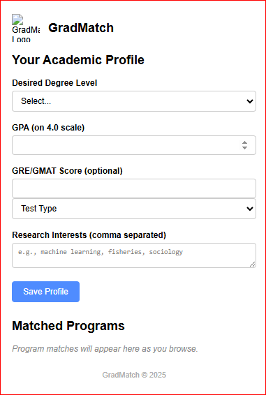

This is a web extension that supports prospective  students in their search for a graduate program that fits their needs. It is a pop up that allows users to iput their preferences and then returns a ranked list of programs that match their preferences. these preferences calculate the student's fit based on a a likelihood algorithm. The algorithm is based on the following factors:
- Program Type
- Program Length
- Program Location
- Program Cost
- Program name
- Degree type
- Department
- Average GPA (if available)
- Acceptance rate (if available)
- Application deadline
- Funding information
- Research areas

The extension leverages the dynamic capabilites of OpenAI's GPT-4.0 to ensure serverless functionality. The extension is designed to be user-friendly and intuitive, with a clean and modern interface. The extension is built using HTML, CSS, and JavaScript, and is compatible with all major web browsers.

This extension is copyrighted by Stellamaris the founder of Stella_Space labs. No free use of this extension is allowed.  

It is a full business model to support students reduce their time and effort in searching for a graduate program and also bring collaboration between students and universities, especially those that are not well known. The extension is designed to be a valuable resource for students, helping them to find the right program for their needs and goals. The extension is also designed to be a valuable resource for universities, helping them to attract and retain students.

Using the extension will cost $10.00 per 5 basic report searches. For comprehensive searches, a different pricing model will be used. If you are a university and would like to partner with us, please contact us at stellamarisus16@gmail.com  
